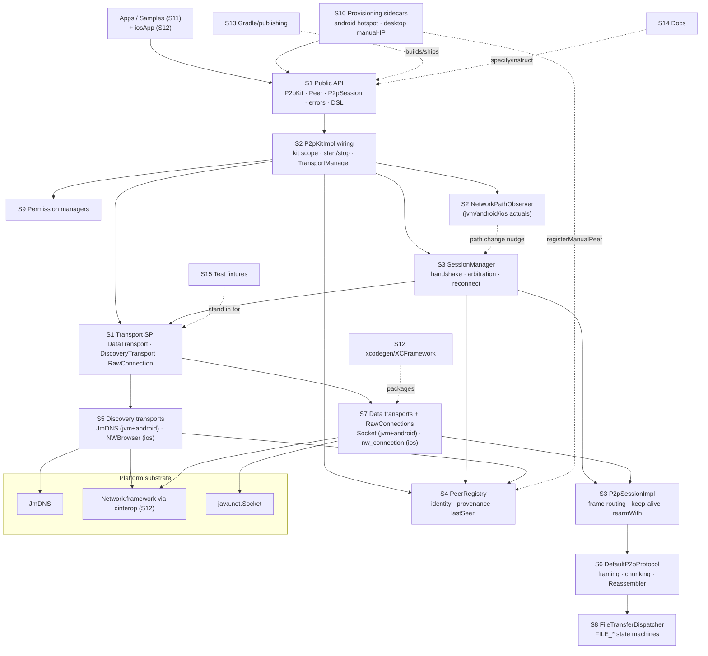
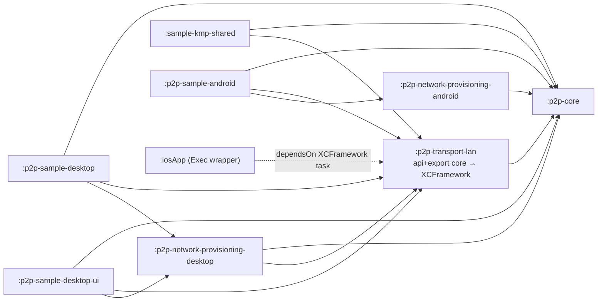

# P2pKit — Codebase Review Map (2026-07)

Phase 0 artifact of the full-project review campaign started 2026-07-03 on
branch `audit/exhaustive-review-2026-06` at HEAD `870bf10` (the 9 remediation
commits from `REMEDIATION_2026-07.md` are included and under review like any
other code). Companion documents: `CODEBASE_REVIEW_TRACKER_2026-07.md` (per-file
status), `CODEBASE_FINDINGS_2026-07.md` (findings register),
`TEST_COVERAGE_PLAN_2026-07.md`, `FINAL_REVIEW_SUMMARY_2026-07.md`.

## Review universe

- **235 tracked files** (`git ls-files`), ~38,077 lines, **plus 1 untracked
  file** (`P2PKIT_GAP_ANALYSIS_2026-07.md`, origin unknown — reviewed and
  documented, not modified) = **236 files**.
- Working-tree state at campaign start: `M CLAUDE.md` (uncommitted `/init`
  rewrite — reviewed in its modified form), `?? P2PKIT_GAP_ANALYSIS_2026-07.md`.
- Ignored build outputs (`build/`, `.gradle/`, generated Xcode project) are not
  repository files and are out of scope; the *generators* (gradle files,
  `project.yml`, scripts) are in scope.
- Raw agent reports live in `.review-2026-07/reports/` (untracked working
  artifacts); the five campaign deliverables live at the repo root.

## Sections

Every file belongs to exactly one section (S1–S15); the tracker is grouped by
these. "Risk" reflects concurrency/lifecycle complexity, platform variance,
history of defects (58 hardening fixes + 21 remediation findings), and blast
radius.

### S1 — Public API surface (31 files, owner A2-API)

- **Owns:** the locked app-facing contract: `P2pKit`, `Peer`, `P2pSession`,
  `P2pMessage`, `Config`, typed errors (`Errors.kt`,
  `NetworkProvisioningError`), `States`, `Identity` (PeerId/AppId),
  `NetworkPath`, `P2pLogger`, builder DSL (`dsl/Builders.kt`), file-transfer
  models (`transfer/`), permission API (`permission/`), provisioning API
  (`provisioning/`), `security/SecurityManager` placeholder, and the
  **transport SPI** (`transport/`: `DataTransport`, `DiscoveryTransport`,
  `RawConnection`, `TransportFactory`, `Internal.kt` with
  `InternalPeer`/`PeerOrigin`, `HasLocalTcpEndpoint`) plus
  `androidMain/…/android/P2pKitAndroid.kt` (context holder).
- **Depends on:** (almost) nothing internal — pure contracts +
  kotlinx.coroutines types, except `dsl/Builders.kt` imports
  `internal.PeerIdStorage`/`internal.newP2pKit` and the `P2pKit` companion
  delegates to the internal impl (A2 review correction).
- **Depended on by:** every other section.
- **Runtime/lifecycle boundaries:** none of its own; defines the contracts
  (flows never complete, `send` suspends, sessions owned by kit).
- **Platform boundaries:** `P2pKitAndroid` (Android context), everything else
  common.
- **Public vs internal:** all public; `transport/` and `Internal.kt` are
  public-but-documented-internal (SPI for out-of-module transports).
- **Test coverage:** indirectly via every suite; no dedicated contract tests;
  `P2pKit-Spec.md` is the reference.
- **Risk: Medium** — low churn, but any defect is a contract defect; spec
  drift is the main hazard.

### S2 — Kit wiring & platform services (19 files, owner A1-ARCH)

- **Owns:** `P2pKitImpl` (builder→wiring, kit scope, start/stop,
  `ensureStarted`, stop-hang guards), `TransportManager`, the expect/actual
  platform seams: `Platform` (`systemTimeMillis`, `currentPlatform`),
  `NativeBuildLog`, `NetworkPathObserverFactory` + `NoOpNetworkPathObserver` +
  `AndroidNetworkPathObserver`(+factory), `IosNetworkPathObserver`(+factory),
  `JvmNetworkPathObserverFactory`.
- **Expect/actual inventory (verified):** 6 expects, all `internal` in
  p2p-core commonMain: `defaultPeerIdStorage`, `systemTimeMillis`,
  `currentPlatform`, `nativeBuildInfoLog`, `defaultNetworkPathObserver`,
  `defaultPlatformPermissionManager`. No expects in transport-lan common
  (platform DSLs are per-source-set extension functions).
- **Depends on:** S1, S3 (creates SessionManager), S4 (creates PeerRegistry),
  S6 (constructs `DefaultP2pProtocol` directly — `P2pKitImpl.kt:97`),
  S9 (permission manager), transport SPI (instantiates via TransportFactory).
- **Depended on by:** app entry (builder), samples.
- **Runtime/lifecycle:** owns the kit `CoroutineScope`; `startMutex` +
  `stopped` flag; teardown ordering (advertising/discovery stop → sessions →
  transports → path observer → scope cancel).
- **Platform boundaries:** the 6 expect/actual seams; ConnectivityManager
  (Android) / `nw_path_monitor` (iOS) observers. Note: the S2 observers feed
  only `SessionManager.applyPathChange`; transport-lan rebind is driven by the
  transports' own internal monitors (zero `NetworkPathObserver` references in
  transport-lan — verified).
- **Public vs internal:** all internal.
- **Test coverage:** `KitLifecycleTest`, `TransportManagerTest` (common), plus
  `NetworkPathRecoveryTest` (observer wiring end-to-end), `PermissionGateTest`
  (`ensurePermissions`), `LocalIdentityTest` (`newP2pKit`); platform observers
  themselves have **no automated tests**.
- **Risk: Medium-High** — lifecycle ordering and stop-vs-start races; two
  remediation fixes (#17) live here.

### S3 — Session lifecycle (13 files, owner A3-SESSION)

- **Owns:** `SessionManager` (connect/accept, HELLO handshake, simultaneous-open
  arbitration, reconnect handling + discovery refresh cadence),
  `P2pSessionImpl` (per-session state machine, Mutex-serialized writes, frame
  routing, `rearmWith` rearm-on-reconnect, keep-alive, `transitionToTerminal`
  single terminal codepath), `SessionStore` (single source of truth,
  `strictInvariants` enforcement — the enable flag also spans a `SessionManager`
  ctor param), `Handshake.kt`
  (HELLO exchange helper). Tests: `SessionFlowTest`, `CloseSemanticsTest`,
  `KeepAliveTest`, `ReconnectPolicyTest`, `SessionReconnectRotationTest`,
  `SessionStoreInvariantTest`, `SimultaneousOpenTest`,
  `NetworkPathRecoveryTest`, `HandshakeTest`.
- **Depends on:** S1 models, S4 (re-resolve peers on retry), S6 (protocol per
  session), transport SPI, S2 (clock via `Platform`).
- **Depended on by:** S2, S8 (dispatcher lives per session).
- **Runtime/lifecycle:** per-session scopes; `Reconnecting` window semantics
  (outgoing-only retry, clean-close never retries); terminal transitions
  single-codepath.
- **Platform boundaries:** none (pure common).
- **Public vs internal:** internal (behind `P2pSession` API).
- **Test coverage:** strongest in repo (~2.1k test lines, 9 classes).
- **Risk: High** — the concurrency heart; most audit findings clustered here.

### S4 — Peer identity & provenance (16 files, owner A4-IDENTITY)

- **Owns:** `PeerRegistry` (event aggregation/dedupe, lastSeen, manual peers),
  local peer-id persistence: `PeerIdStorage` (+ expect factory),
  `InMemoryPeerIdStorage`, `FilePeerIdStorage` (androidMain + jvmMain, two
  distinct files), `NSUserDefaultsPeerIdStorage`, 3 `PeerIdStorageFactory`
  actuals. Tests: `PeerRegistryTest`, `ManualPeerIdentityTest`,
  `HandshakeIdentityTest`, `LocalIdentityTest`, `InMemoryPeerIdStorageTest`,
  `FilePeerIdStorageTest` (jvm), `PeerIdPersistenceIntegrationTest` (jvm).
- **Depends on:** S1 (`Peer`, `InternalPeer`, `PeerOrigin`), platform FS /
  NSUserDefaults.
- **Depended on by:** S2, S3 (identity checks in handshake), provisioning
  (`ManualPeerRegistrar` → `registerManualPeer`).
- **Runtime/lifecycle:** registry lives for the kit lifetime; storage is
  process-external state (survives restarts — the only persistent state in
  the SDK).
- **Platform boundaries:** 3 storage backends must behave identically
  (corrupt/missing file handling).
- **Public vs internal:** internal.
- **Known deliberate deferrals:** inbound HELLO peerId unverified until the
  encryption milestone (`TODO(encryption-milestone)`). Corrected during
  review: `registerManualPeer` DOES dedupe by (host, port, kind) since
  `b9f6311`; the "no dedupe — deferred" line in REMEDIATION_2026-07.md:63 is
  stale (finding IDN-5).
- **Test coverage:** good on handshake-identity; the manual-peer/provenance
  half of PeerRegistry has no direct tests; storage corrupt-file coverage
  partial (jvm only, JVM legacy migration uncovered).
- **Risk: Medium-High** — spoofing surface; provenance fix (#2/#13) is new.

### S5 — Discovery transports & LAN plumbing (18 files, owner A5-DISCOVERY)

- **Owns:** `JvmLanDiscoveryTransport` (JmDNS), `AndroidLanDiscoveryTransport`
  (in-process JmDNS + multicast lock + rebind/`*IfIdle`/intent flags — **must
  not reintroduce NsdManager**), `IosLanDiscoveryTransport` (NWBrowser +
  announce-cache generations), `IosBonjour` (TXT codec), `IosEndpointRegistry`,
  shared plumbing: `Lan.kt` (common config), 3 platform `…LanDsl.kt`, 3 trace
  layers (`JvmLanDiag`, `AndroidLanDiag`, `IosLanDebug`), `IosSwiftHelpers`.
  Tests: `HostSelectorTest`, `AnnounceCacheReconcileTest`, `IosBonjourTest`,
  `IosLanLifecycleTest` (contains the 2 known-flaky churn tests),
  `IosLanDiagnosticTest`.
- **Depends on:** S1 SPI, JmDNS library, Network.framework, S12 cinterop.
- **Depended on by:** S2 (start/stop/refresh), S3 (refresh during reconnect
  window), S4 (PeerEvents feed the registry).
- **Runtime/lifecycle:** JmDNS instance ownership + rebind on network change;
  NWBrowser generation lifecycle; wire-parity constraint: service type
  `_p2pkit._tcp` + identical TXT keys across platforms.
- **Platform boundaries:** three fully separate implementations of one
  contract — parity is a review dimension in itself.
- **Public vs internal:** internal (behind `transports { lan() }`).
- **Test coverage:** JVM via loopback; **Android has zero automated tests**
  (manual recipes only); iOS appleTest incl. 2 documented simulator flakes.
- **Risk: High** — largest files, platform APIs with callback lifecycles,
  history of rebind/ghost-peer bugs; 4 remediation fixes are new here.

### S6 — Wire protocol (20 files, owner A7-PROTO)

- **Owns:** `Frame`/`FrameCodec` (PP2K magic, v1, 36-byte header),
  `FrameReader`, `Chunker`, `Reassembler` (caps: dup/range rejection,
  aggregate `MAX_TOTAL_PENDING_BYTES`, inactivity eviction),
  `DefaultP2pProtocol` (single `writeFrame` choke point + `FrameTrace`),
  `HelloPayload`, `FileOfferPayload`, `ProtocolConstants` (4 MiB message,
  8 MiB frame, 64 KiB chunks, reassembly caps), `P2pProtocol`/`ProtocolEvent`
  interfaces. Tests: 8 classes incl. `ReassemblerTest` (14 cases).
- **Depends on:** S1 models only; pure common, no I/O.
- **Depended on by:** S2 (P2pKitImpl constructs it), S3, S8; **all three
  platform transports must stay wire-compatible with it**.
- **Runtime/lifecycle:** reassembler holds cross-frame state (the resource-limit
  surface); evictStale driven per read batch.
- **Platform boundaries:** none in code, but constants/format changes must be
  mirrored in all transports (parity rule).
- **Public vs internal:** internal.
- **Test coverage:** strong unit coverage; malformed-input coverage is the
  review question.
- **Risk: Medium-High** — parses untrusted bytes; remediation group A is new.

### S7 — Data transports & raw connections (9 files, owner A6-CONN)

- **Owns:** `JvmLanDataTransport`, `AndroidLanDataTransport`,
  `IosLanDataTransport` (dial/listen, parameters CAS, inbound accept path),
  `JvmRawConnection` + `AndroidRawConnection` (intentionally duplicated pair —
  **must stay behaviorally identical**: 30 s write watchdog on connection-owned
  scope, `closeSocketOnce` CAS, read-loop EOF fd release), `IosRawConnection`
  (nw_connection send/receive, `withTimeout` write deadline, `cancelOnce`).
  Tests: `JvmLanLoopbackTest` (incl. fd-leak assertion), `IosLanLoopbackTest`,
  `IosRawConnectionTest`.
- **Depends on:** S1 SPI, java.net.Socket, Network.framework + S12 cinterop,
  S5 (endpoint resolution/registry on iOS).
- **Depended on by:** S3 via `TransportManager`.
- **Runtime/lifecycle:** connection-owned scopes; watchdog races; fd/NW-object
  ownership; cellular prohibited on iOS parameters (v0.6 — don't relax).
- **Platform boundaries:** JVM/Android duplicated pair + iOS — three-way
  behavior parity (timeouts, close semantics, error surfacing).
- **Public vs internal:** internal.
- **Test coverage:** JVM loopback good; **Android raw connection has no
  automated tests** (parity by review); iOS partial.
- **Risk: High** — blocking I/O + watchdogs + interop ownership; remediation
  group D is new.

### S8 — File transfer (12 files, owner A8-FILET)

- **Owns:** `FileTransferDispatcher` (FILE_* routing, per-transfer error
  isolation, offer TOCTOU guard, lazy streamer), `IncomingFileSession`,
  `OutgoingFileTransferImpl`, `StreamingFileReceiver`/`Sender` (kotlinx-io),
  platform source/sink constructors (`FileTransferJvm`, `FileTransferAndroid`).
  Tests: `FileTransferFlowTest`, `FileTransferErrorIsolationTest`,
  `StreamingFileReceiverTest`, `StreamingFileSenderTest`, `FileTransferJvmTest`.
- **Depends on:** S6 (frames/payloads), S1 transfer API, kotlinx-io.
- **Depended on by:** S3 (`P2pSessionImpl` routes FILE_* frames), S1
  (`session.sendFile`).
- **Runtime/lifecycle:** per-transfer state machines under one dispatcher
  lock; transfer failure must never tear down a healthy session; sender owns
  the source (kit closes it — documented contract).
- **Platform boundaries:** JVM/Android file APIs vs iOS paths.
- **Public vs internal:** dispatcher internal; models public.
- **Test coverage:** good, incl. new error-isolation tests.
- **Risk: Medium-High** — disk I/O failure modes; remediation group B is new.

### S9 — Permissions (5 files, owner A9-PERMPROV)

- **Owns:** `PermissionManagerFactory` expect + 3 actuals (Android: no runtime
  perms + `warnIfLanManifestPermissionsUndeclared`; iOS/JVM: none).
  Test: `PermissionGateTest`.
- **Depends on:** S1 permission API; Android Context/PackageManager.
- **Depended on by:** S2 (`ensurePermissions`, `P2pKit.permissions`).
- **Boundaries:** SDK never requests permissions itself — reports only.
- **Test coverage:** common-level gate test; Android actual untested by
  automation (host-JVM limits).
- **Risk: Medium** — regression #9 just fixed; compatibility-sensitive.

### S10 — Network provisioning (14 files, owner A9-PERMPROV)

- **Owns:** `p2p-network-provisioning-android` (LocalOnlyHotspot host + Wi-Fi
  join: manager, `WifiManagerWrapper`(+Impl), `AndroidP2pPermissionManager`,
  DSL, factory, manifest, 478-line host test) and
  `p2p-network-provisioning-desktop` (manual-IP fallback: manager, DSL,
  factory, 2 tests), plus `IosManualNetworkProvisioningManager` (in
  transport-lan appleMain; iOS provisioning is permanently `Unsupported` —
  Apple policy).
- **Depends on:** S1 provisioning API + core; desktop sidecar also depends on
  transport-lan (verified in its build file); Android WifiManager.
- **Depended on by:** samples only (optional sidecars).
- **Runtime/lifecycle:** hotspot callbacks, reservation ownership,
  Android API-level branches (minSdk 24 → hotspot requires 26+).
- **Test coverage:** android host test + desktop tests — best-covered sidecar.
- **Risk: Medium** — isolated blast radius, but OS-callback lifecycles.

### S11 — Samples & harnesses (13 files, owner A16-SAMPLES)

- **Owns:** `p2p-sample-desktop` (CLI, 774 ln), `p2p-sample-desktop-ui`
  (Compose, 1752 ln), `p2p-sample-android` (Compose: MainActivity 1354 ln,
  ViewModel 1215 ln, Application, manifest, theme), `sample-kmp-shared`
  (factory expect/actual demo + `KmpCallsiteSmokeTest`,
  `KmpConsumerLoopbackTest`). (iosApp Swift sample is in S12 with its build
  integration.)
- **Depends on:** published API of core + transport-lan + provisioning.
- **Depended on by:** docs (recipes reference sample behavior); not published.
- **Review depth:** API-usage correctness, `collect{collect{}}` rule, scope
  leaks, drift vs README/INTERNAL_TESTING recipes — samples are executable
  documentation.
- **Test coverage:** kmp-shared smoke/loopback only; apps manual.
- **Risk: Low-Medium** — not shipped, but they teach integrators patterns.

### S12 — iOS/Xcode build integration (10 files, owner A10-IOSBUILD)

- **Owns:** `iosApp/` app sources (ContentView.swift 1534 ln,
  P2pKitSampleApp.swift, Info.plist — xcodegen-generated output of
  project.yml, not hand-editable source (IOSB-9)), `iosApp/build.gradle.kts` (Exec wrapper:
  `runIosSimulator` dependsOn `assembleP2pKitSharedReleaseXCFramework`),
  `iosApp/project.yml` (xcodegen — `NSLocalNetworkUsageDescription` /
  `NSBonjourServices` keys are load-bearing and must stay in the yml),
  `iosApp/scripts/` (README, `check-xcframework.sh` stamp check),
  `scripts/run-ios-app.sh`, cinterop `p2pkit_nw.def` + `p2pkit_nw.h`
  (void-returning ObjC block-macro wrappers K/N can't box).
- **Depends on:** transport-lan XCFramework task, xcodegen/xcodebuild/simctl.
- **Depended on by:** iOS sample workflow, `INTERNAL_TESTING.md` recipes.
- **Risk: Medium** — regenerated-project key-drop trap; stamp-check logic
  (#10) is new.

### S13 — Build, Gradle, publishing & release (26 files, owner A11-BUILD)

- **Owns:** root `build.gradle.kts` (group/version to all modules, central
  signing — Sign tasks SKIPPED without `signingInMemoryKey`),
  `settings.gradle.kts` (9 modules), `gradle.properties`
  (GROUP/VERSION_NAME=0.6.x), `gradle/libs.versions.toml`, daemon-jvm
  properties, wrapper (jar = binary — version/provenance check only, `gradlew`,
  `gradlew.bat`, wrapper.properties), `.editorconfig`, `.gitignore`, 7 `.run/`
  IDE configs, and the 8 module `build.gradle.kts` files (core, transport-lan
  incl. XCFramework + cinterop wiring + BUILD_COMMIT stamp, 2 provisioning, 4
  samples).
- **Depends on:** —. **Depended on by:** everything (defines targets,
  toolchains — Java 17, publishing coordinates).
- **Risk: Medium** — release gate correctness (publishing/signing/POMs per
  `STABILIZATION_AND_RELEASE.md` Part B); no automated verification.

### S14 — Documentation (26 files, owner A13-DOCS ×2 batches)

- **Owns (batch a, dev-critical):** `CLAUDE.md` (modified, uncommitted),
  `README.md`, `P2pKit-Spec.md` (1440 ln — the API contract),
  `INTERNAL_TESTING.md`, `docs/STABILIZATION_AND_RELEASE.md`,
  `docs/LAN_DIAGNOSTICS_PROTOCOL.md`, `docs/production-readiness.md`,
  `WORKSPACE_SYNC_DASHBOARD.md`, `REMEDIATION_2026-07.md`,
  `P2PKIT_GAP_ANALYSIS_2026-07.md` (untracked — identify + document),
  `docs/ios-sample-app/` deprecated template (6 files).
- **Owns (batch b, audit/history):** `AUDIT_REPORT_2026-06.md`,
  `PROBLEMS_P2PKIT.md` (older audit — IDs/counts drifted),
  `docs/audit-evidence/` (README + 2 logs),
  `docs/audit-real-device-checklist.md`,
  `docs/hardware-validation-checklist.md`,
  `docs/stabilization-stress-tests.md`,
  `docs/v0.4-cumulative-validation-runbook.md`, `LICENSE`.
- **Review dimensions:** drift vs current code, load-bearing accuracy for
  future agents, contradictions between docs, stale instructions.
- **Risk: Medium** — docs steer future agents; a wrong instruction becomes a
  wrong change.

### S15 — Test fixtures (4 files, owner A12-TESTS)

- **Owns:** `commonTest/testfixtures/`: `FakeDataTransport`,
  `FakeDiscoveryTransport`, `FakeNetworkPathObserver`, `FakeRawConnection`.
- **Depended on by:** all commonTest suites — a fake that diverges from real
  transport behavior silently blinds every test above it (highest-leverage
  test-quality risk in the repo).
- **Risk: Medium** — small files, outsized blast radius.

## Dependency graph — runtime/data flow (sections)

## Dependency graph — Gradle modules (verified from build files)

## Reviewer roster, waves, and user-spec mapping

17 agent runs, all `model: fable`, 2–3 concurrent, background, edit-free
(reports only). Mapping to the requested 15 reviewer roles: 1→A1, 2→A2, 3→A3,
4→A4, 5→A5, 6→A6, 7→A7, 8→A8, 9→A9 (permissions+provisioning), 10→A10,
11→A11, 12→A12, 13→A13a+A13b (docs split for depth), 14→A14, 15→A15; A16
(samples) added so sample code has a primary owner.

| Wave | Agents (scope → report) |
|---|---|
| 1 | A7-PROTO (S6) · A6-CONN (S7) · A1-ARCH (S2 + cross-cutting boundaries + validate this map) |
| 2 | A3-SESSION (S3) · A5-DISCOVERY (S5) — the two heaviest, run as a pair |
| 3 | A4-IDENTITY (S4) · A8-FILET (S8) · A11-BUILD (S13) |
| 4 | A2-API (S1) · A9-PERMPROV (S9+S10) · A10-IOSBUILD (S12) |
| 5 | A16-SAMPLES (S11) · A13a-DOCS-core · A13b-DOCS-audit |
| 6 | A14-SEC (cross-cutting) · A15-PERF (cross-cutting) · A12-TESTS (S15 + repo-wide test-quality sweep) |

Cross-cutting agents (A1/A14/A15) own no tracker rows except A1's S2; their
findings attach to the owning section's files. Standing rules for every agent
are in `.review-2026-07/BRIEF.md` (read-only review, no gradle, evidence with
file:line, call-site cross-checks mandatory, bugs separated from improvements,
uncertainty labeled, no flaky-test masking proposals, public-API changes only
flagged never assumed).

## Campaign rules of engagement

1. No file skipped — 236/236 must reach "reviewed" in the tracker.
2. No "looks fine" without call-site checks; every claim carries file:line.
3. Findings vs improvements kept distinct; speculation labeled with what
   evidence would settle it.
4. No fixes during review (only if tiny AND blocking the review itself —
   none anticipated); no public API changes; no push/PR without approval.
5. Remediation commits stay intact; `CLAUDE.md` working-tree edit and
   `P2PKIT_GAP_ANALYSIS_2026-07.md` are reviewed, documented, not modified.
6. Model policy: all review agents on Fable 5. Any safeguard fallback to
   another model → hard stop: record where, save tracker state, report which
   scope was interrupted, await approval. Plain rate limits → wait ~1 min,
   continue same agent.
7. Findings are cross-referenced against `AUDIT_REPORT_2026-06.md` /
   `PROBLEMS_P2PKIT.md` / `REMEDIATION_2026-07.md` during consolidation so
   catalogued deferrals aren't re-reported as new discoveries (they're marked
   "previously catalogued" with the original ref).
